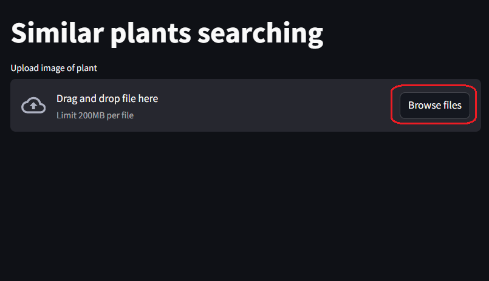
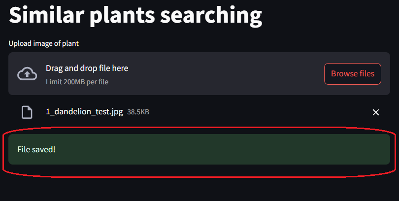

# Поиск похожих растений

**Содержание**:

* [Введение](#введение)
* [Развертывание проекта](#развертывание-проекта)
* [Пример работы](#пример-работы)

## Введение

В данном проекте осуществляется поиск похожих растений (5-ти штук) на основе входного изображения.
Оценка схожести изображений реализована с помощью расчета косинусного расстояния между картой признаков входного изображения и картами признаков изображений, которые хранятся локально.
Карта признаков изображения формируется путем прямого прохода входного (преобразованного) изображения через сеть ResNet50, предобученную на датасете ImageNet, на слое сети, расположенном перед полносвязным слоем.
Для каждого изображения в датасете был заранее сформирован файл "data/features.pkl", содержащий путь и карту признаков. Формирование этого файла можно посмотреть в "notebooks/01-create_embeddings_data.ipynb".
Взаимодействие с проектом реализовано через Streamlit.

## Развертывание проекта

1. Загрузка датасета:
    - загрузить датасет по [ссылке](https://www.kaggle.com/datasets/alxmamaev/flowers-recognition/data); 
    - распаковать; 
    - зайти в папку "archive" и вырезать или скопировать папку "flowers"; 
    - вставить по пути "./data/" и переименовать в "dataset";
2. Собрать докер образ и запустить контейнер с проектом:
<pre>docker compose up -d</pre>
3. Перейти по ссылке:
<pre>http://localhost:8501</pre>

## Пример работы

1. Загрузить изображение растения:

2. Дождаться уведомления, что изображение успешно загружено:

3. Загрузить полученный результат:

**Пример выходных данных**:

<pre>
[
{"image_path": "../data/dataset\\dandelion\\5862288632_1df5eb6dd0.jpg", "similarity_score": 0.212}, 
{"image_path": "../data/dataset\\dandelion\\4557781241_0060cbe723_n.jpg", "similarity_score": 0.2149}, 
{"image_path": "../data/dataset\\dandelion\\2443192475_c64c66d9c2.jpg", "similarity_score": 0.2228}, 
{"image_path": "../data/dataset\\dandelion\\9029297232_de50698e2f_n.jpg", "similarity_score": 0.2312}, 
{"image_path": "../data/dataset\\dandelion\\6953830582_8525e0423c_n.jpg", "similarity_score": 0.2328}
]
</pre>
